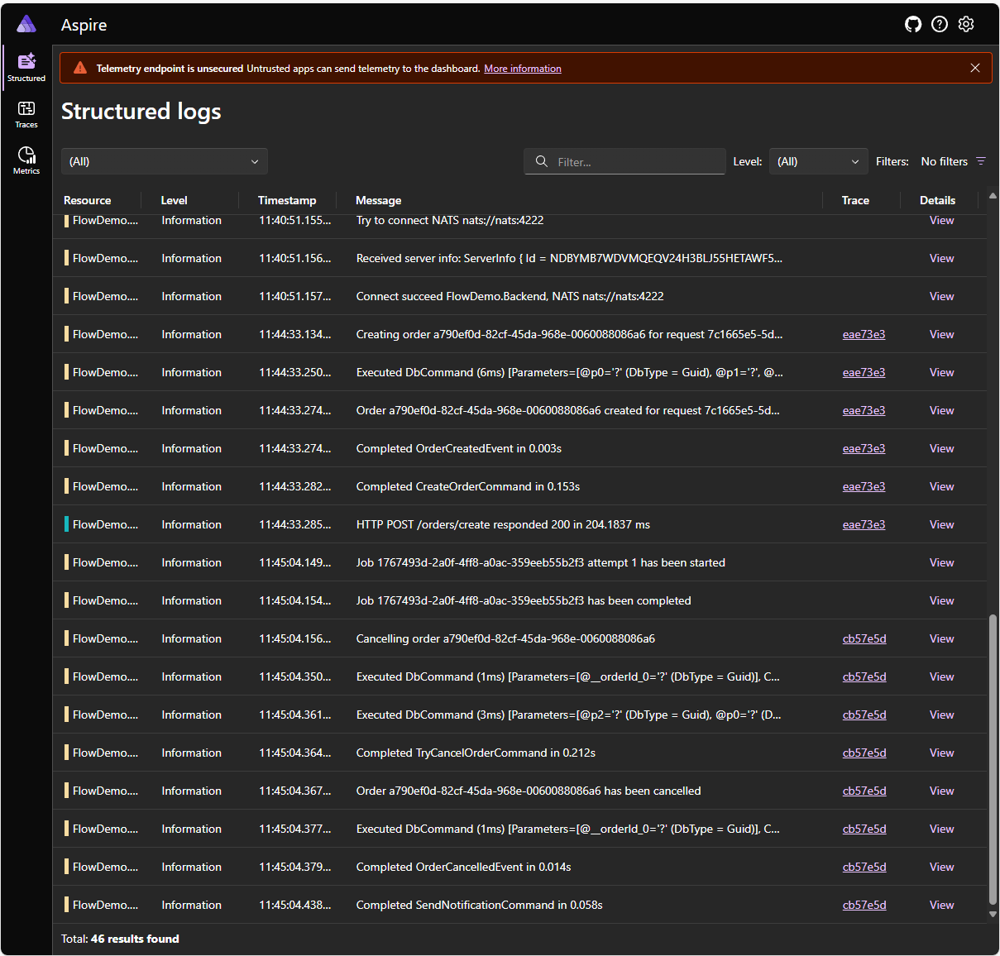
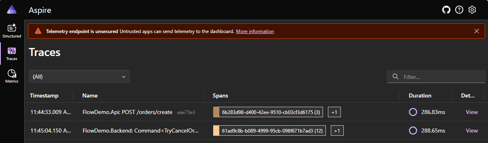
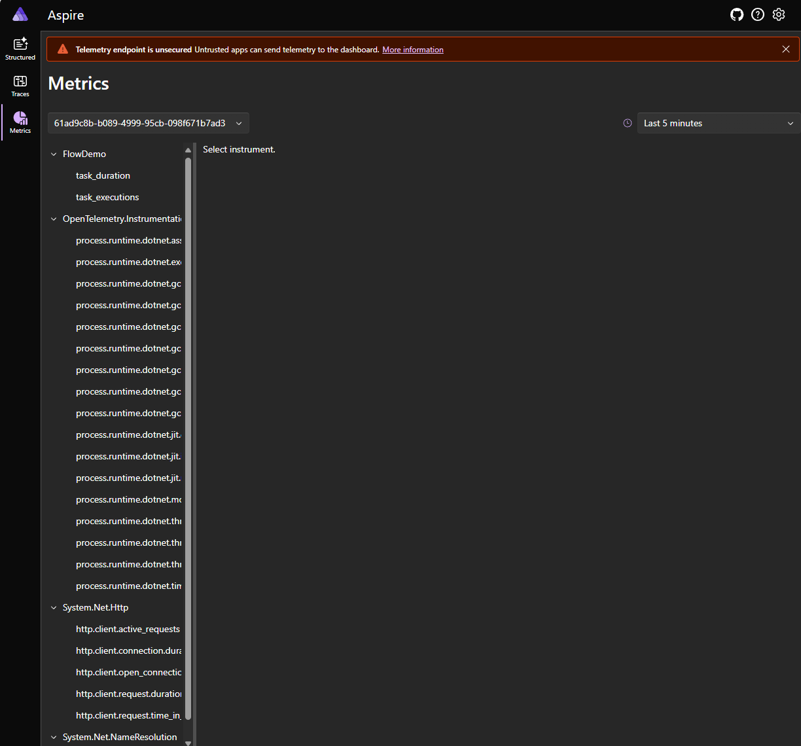
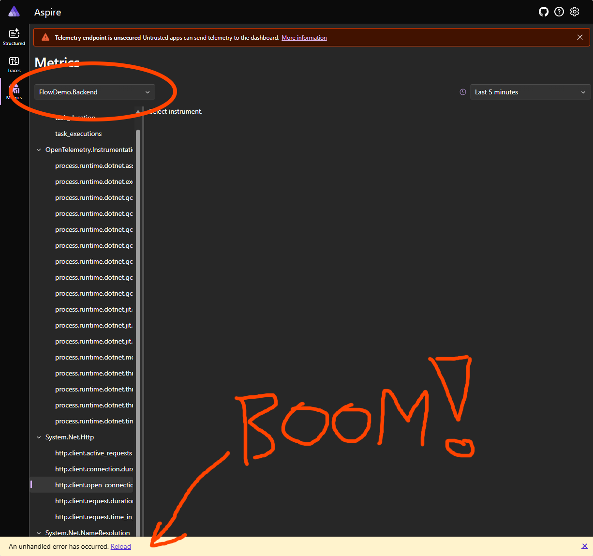

# Metrics won't display - Unhandled exception rendering component

https://github.com/dotnet/aspire/issues/4317

This ticket seems to be closed with "I'm going to close as I'm pretty sure this is already fixed."

Well, sounds like a wishfull thinking ;-)

I've tested it with `mcr.microsoft.com/dotnet/aspire-dashboard:8.0.0` and 
`mcr.microsoft.com/dotnet/nightly/aspire-dashboard:6975aead4f0c` and in both cases
the result is the same.

## Reproduce

In `<root>\res\ISSUE-4317` build it with:

```powershell
.\build.cmd
```

and then start all containers:

```powershell
.\start.cmd
```

open aspire dashboard with the url which can be found in dashboard log, for example:

```log
http://localhost:18888/login?t=a7a5073be654a134ec382b4d581286f2
``

then open `request.http` and run `CreateOrder` request which is:

```http
POST http://localhost:5234/orders/create
Accept: application/json
Content-Type: application/json

{
  "requested_by": "customer@company.com"
}
```

expected reponse is something like this:

```
HTTP/1.1 200 OK
Connection: close
Content-Type: application/json; charset=utf-8
Date: Tue, 02 Jul 2024 10:44:32 GMT
Server: Kestrel
Transfer-Encoding: chunked

{
  "request_id": "7c1665e5-5d12-4abf-9435-e0b0e4eeae7d",
  "order_id": "a790ef0d-82cf-45da-968e-0060088086a6",
  "created_by": "customer@company.com"
}
```

When you look at dashboard, you should see:

* logs:



* traces:



* metrics:



## However...

It worked only becasue we clicked a "guid thingy" in metrics source selection, if we click a service name it goes ka-boom:



```
2024-07-02 10:10:36 warn: Microsoft.AspNetCore.Components.Server.Circuits.RemoteRenderer[100]
2024-07-02 10:10:36       Unhandled exception rendering component: Sequence contains more than one matching element
2024-07-02 10:10:36       System.InvalidOperationException: Sequence contains more than one matching element
2024-07-02 10:10:36          at System.Linq.ThrowHelper.ThrowMoreThanOneMatchException()
2024-07-02 10:10:36          at System.Linq.Enumerable.TryGetSingle[TSource](IEnumerable`1 source, Func`2 predicate, Boolean& found)
2024-07-02 10:10:36          at System.Linq.Enumerable.SingleOrDefault[TSource](IEnumerable`1 source, Func`2 predicate)
2024-07-02 10:10:36          at Aspire.Dashboard.Components.Pages.Metrics.UpdateViewModelFromQuery(MetricsViewModel viewModel) in /_/src/Aspire.Dashboard/Components/Pages/Metrics.razor.cs:line 119
2024-07-02 10:10:36          at Aspire.Dashboard.Components.Pages.PageExtensions.InitializeViewModelAsync[TViewModel,TSerializableViewModel](IPageWithSessionAndUrlState`2 page)
2024-07-02 10:10:36          at Aspire.Dashboard.Components.Pages.Metrics.OnParametersSetAsync() in /_/src/Aspire.Dashboard/Components/Pages/Metrics.razor.cs:line 99
2024-07-02 10:10:36          at Microsoft.AspNetCore.Components.ComponentBase.CallStateHasChangedOnAsyncCompletion(Task task)
2024-07-02 10:10:36 fail: Microsoft.AspNetCore.Components.Server.Circuits.CircuitHost[111]
2024-07-02 10:10:36       Unhandled exception in circuit 'fMjW5yRcp6_PPuqPhZ3p2C38sb2qpVpqDSl8Fu8cPso'.
2024-07-02 10:10:36       System.InvalidOperationException: Sequence contains more than one matching element
2024-07-02 10:10:36          at System.Linq.ThrowHelper.ThrowMoreThanOneMatchException()
2024-07-02 10:10:36          at System.Linq.Enumerable.TryGetSingle[TSource](IEnumerable`1 source, Func`2 predicate, Boolean& found)
2024-07-02 10:10:36          at System.Linq.Enumerable.SingleOrDefault[TSource](IEnumerable`1 source, Func`2 predicate)
2024-07-02 10:10:36          at Aspire.Dashboard.Components.Pages.Metrics.UpdateViewModelFromQuery(MetricsViewModel viewModel) in /_/src/Aspire.Dashboard/Components/Pages/Metrics.razor.cs:line 119
2024-07-02 10:10:36          at Aspire.Dashboard.Components.Pages.PageExtensions.InitializeViewModelAsync[TViewModel,TSerializableViewModel](IPageWithSessionAndUrlState`2 page)
2024-07-02 10:10:36          at Aspire.Dashboard.Components.Pages.Metrics.OnParametersSetAsync() in /_/src/Aspire.Dashboard/Components/Pages/Metrics.razor.cs:line 99
2024-07-02 10:10:36          at Microsoft.AspNetCore.Components.ComponentBase.CallStateHasChangedOnAsyncCompletion(Task task)
2024-07-02 10:10:36 warn: Microsoft.AspNetCore.Components.Server.Circuits.RemoteRenderer[100]
2024-07-02 10:10:36       Unhandled exception rendering component: Encountered unsupported frame type during diffing: None
2024-07-02 10:10:36       System.NotImplementedException: Encountered unsupported frame type during diffing: None
2024-07-02 10:10:36          at Microsoft.AspNetCore.Components.RenderTree.RenderTreeDiffBuilder.AppendDiffEntriesForFramesWithSameSequence(DiffContext& diffContext, Int32 oldFrameIndex, Int32 newFrameIndex)
2024-07-02 10:10:36          at Microsoft.AspNetCore.Components.RenderTree.RenderTreeDiffBuilder.AppendDiffEntriesForRange(DiffContext& diffContext, Int32 oldStartIndex, Int32 oldEndIndexExcl, Int32 newStartIndex, Int32 newEndIndexExcl)
2024-07-02 10:10:36          at Microsoft.AspNetCore.Components.RenderTree.RenderTreeDiffBuilder.AppendDiffEntriesForFramesWithSameSequence(DiffContext& diffContext, Int32 oldFrameIndex, Int32 newFrameIndex)
2024-07-02 10:10:36          at Microsoft.AspNetCore.Components.RenderTree.RenderTreeDiffBuilder.AppendDiffEntriesForRange(DiffContext& diffContext, Int32 oldStartIndex, Int32 oldEndIndexExcl, Int32 newStartIndex, Int32 newEndIndexExcl)
2024-07-02 10:10:36          at Microsoft.AspNetCore.Components.RenderTree.RenderTreeDiffBuilder.AppendDiffEntriesForFramesWithSameSequence(DiffContext& diffContext, Int32 oldFrameIndex, Int32 newFrameIndex)
2024-07-02 10:10:36          at Microsoft.AspNetCore.Components.RenderTree.RenderTreeDiffBuilder.AppendDiffEntriesForRange(DiffContext& diffContext, Int32 oldStartIndex, Int32 oldEndIndexExcl, Int32 newStartIndex, Int32 newEndIndexExcl)
2024-07-02 10:10:36          at Microsoft.AspNetCore.Components.RenderTree.RenderTreeDiffBuilder.AppendDiffEntriesForFramesWithSameSequence(DiffContext& diffContext, Int32 oldFrameIndex, Int32 newFrameIndex)
2024-07-02 10:10:36          at Microsoft.AspNetCore.Components.RenderTree.RenderTreeDiffBuilder.AppendDiffEntriesForRange(DiffContext& diffContext, Int32 oldStartIndex, Int32 oldEndIndexExcl, Int32 newStartIndex, Int32 newEndIndexExcl)
2024-07-02 10:10:36          at Microsoft.AspNetCore.Components.Rendering.ComponentState.RenderIntoBatch(RenderBatchBuilder batchBuilder, RenderFragment renderFragment, Exception& renderFragmentException)
2024-07-02 10:10:36          at Microsoft.AspNetCore.Components.RenderTree.Renderer.ProcessRenderQueue()
2024-07-02 10:10:36 fail: Microsoft.AspNetCore.Components.Server.Circuits.CircuitHost[111]
2024-07-02 10:10:36       Unhandled exception in circuit 'fMjW5yRcp6_PPuqPhZ3p2C38sb2qpVpqDSl8Fu8cPso'.
2024-07-02 10:10:36       System.NotImplementedException: Encountered unsupported frame type during diffing: None
2024-07-02 10:10:36          at Microsoft.AspNetCore.Components.RenderTree.RenderTreeDiffBuilder.AppendDiffEntriesForFramesWithSameSequence(DiffContext& diffContext, Int32 oldFrameIndex, Int32 newFrameIndex)
2024-07-02 10:10:36          at Microsoft.AspNetCore.Components.RenderTree.RenderTreeDiffBuilder.AppendDiffEntriesForRange(DiffContext& diffContext, Int32 oldStartIndex, Int32 oldEndIndexExcl, Int32 newStartIndex, Int32 newEndIndexExcl)
2024-07-02 10:10:36          at Microsoft.AspNetCore.Components.RenderTree.RenderTreeDiffBuilder.AppendDiffEntriesForFramesWithSameSequence(DiffContext& diffContext, Int32 oldFrameIndex, Int32 newFrameIndex)
2024-07-02 10:10:36          at Microsoft.AspNetCore.Components.RenderTree.RenderTreeDiffBuilder.AppendDiffEntriesForRange(DiffContext& diffContext, Int32 oldStartIndex, Int32 oldEndIndexExcl, Int32 newStartIndex, Int32 newEndIndexExcl)
2024-07-02 10:10:36          at Microsoft.AspNetCore.Components.RenderTree.RenderTreeDiffBuilder.AppendDiffEntriesForFramesWithSameSequence(DiffContext& diffContext, Int32 oldFrameIndex, Int32 newFrameIndex)
2024-07-02 10:10:36          at Microsoft.AspNetCore.Components.RenderTree.RenderTreeDiffBuilder.AppendDiffEntriesForRange(DiffContext& diffContext, Int32 oldStartIndex, Int32 oldEndIndexExcl, Int32 newStartIndex, Int32 newEndIndexExcl)
2024-07-02 10:10:36          at Microsoft.AspNetCore.Components.RenderTree.RenderTreeDiffBuilder.AppendDiffEntriesForFramesWithSameSequence(DiffContext& diffContext, Int32 oldFrameIndex, Int32 newFrameIndex)
2024-07-02 10:10:36          at Microsoft.AspNetCore.Components.RenderTree.RenderTreeDiffBuilder.AppendDiffEntriesForRange(DiffContext& diffContext, Int32 oldStartIndex, Int32 oldEndIndexExcl, Int32 newStartIndex, Int32 newEndIndexExcl)
2024-07-02 10:10:36          at Microsoft.AspNetCore.Components.Rendering.ComponentState.RenderIntoBatch(RenderBatchBuilder batchBuilder, RenderFragment renderFragment, Exception& renderFragmentException)
2024-07-02 10:10:36          at Microsoft.AspNetCore.Components.RenderTree.Renderer.ProcessRenderQueue()
```